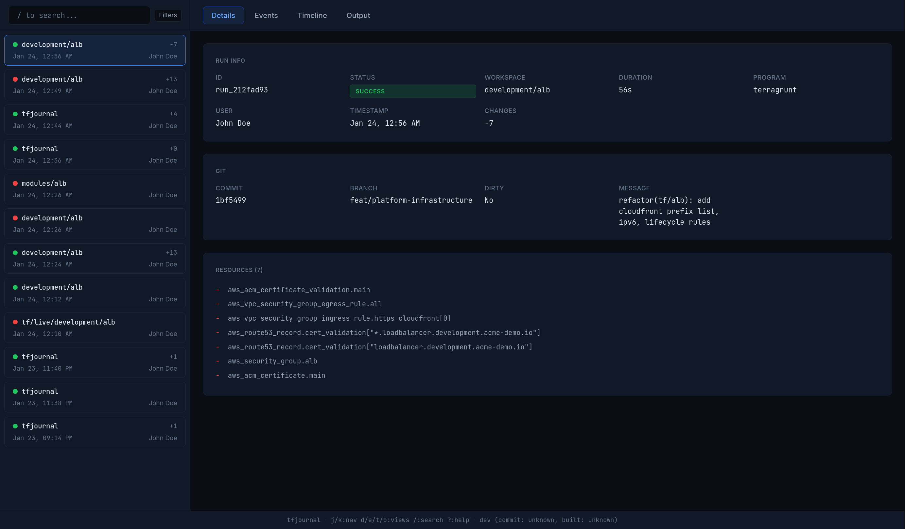

<div align="center">


# tfjournal

Record Terraform runs with git context, timing, and resource events.

[](LICENSE)
[](https://github.com/Owloops/tfjournal/releases/latest)
[](https://goreportcard.com/report/github.com/Owloops/tfjournal)
[](https://github.com/Owloops/tfjournal/actions/workflows/release.yml)


</div>

## Features

<table>
<tr>
<td width="50%">

**Run recording**

Wraps terraform/tofu/terragrunt commands and captures output, timing, exit codes.

</td>
<td width="50%">

**Git and CI context**

Automatically records commit, branch, user, and CI provider info.

</td>
</tr>
<tr>
<td width="50%">

**Resource timeline**

Parses resource-level events and displays them as a gantt chart.

</td>
<td width="50%">

**S3 sync**

Optional S3 backend for sharing history across machines or teams.

</td>
</tr>
</table>

## Installation

### Homebrew

```bash
brew install Owloops/tap/tfjournal
```

### Install script

```bash
curl -sSL https://raw.githubusercontent.com/Owloops/tfjournal/main/install.sh | bash
```

### Go

```bash
go install github.com/Owloops/tfjournal@latest
```

### Build from source

```bash
git clone https://github.com/Owloops/tfjournal.git
cd tfjournal
make build
```

## Usage

```bash
# Record a terraform run
tfjournal -- terraform apply

# Set workspace name manually
tfjournal -w prod -- tofu plan

# Works with terragrunt
tfjournal -- terragrunt apply

# Open TUI
tfjournal

# List runs
tfjournal list
tfjournal list --since 7d --status failed
tfjournal list --action apply

# Show run details
tfjournal show run_abc123
tfjournal show run_abc123 --output
```

### Shell Aliases

```bash
alias tf='tfjournal -- terraform'
alias tofu='tfjournal -- tofu'
alias tg='tfjournal -- terragrunt'
```

## Web UI

```bash
tfjournal serve
```

Opens at <http://localhost:8080>. Same features as TUI with mouse support.



### Configuration

| Env var | Flag | Default | Description |
|---------|------|---------|-------------|
| `TFJOURNAL_PORT` | `--port, -p` | `8080` | Port to listen on |
| `TFJOURNAL_BIND` | `--bind, -b` | `127.0.0.1` | Address to bind to |
| `TFJOURNAL_USERNAME` | - | - | Basic auth username |
| `TFJOURNAL_PASSWORD` | - | - | Basic auth password |

Enable basic auth when exposing beyond localhost:

```bash
TFJOURNAL_USERNAME=admin TFJOURNAL_PASSWORD=secret tfjournal serve --bind 0.0.0.0
```

## S3 Backend

```bash
export TFJOURNAL_S3_BUCKET=my-tfjournal
export TFJOURNAL_S3_REGION=us-east-1
export TFJOURNAL_S3_PREFIX=team-a  # optional
export AWS_PROFILE=my-profile      # optional, uses default credentials if not set
```

Without `TFJOURNAL_S3_BUCKET`, tfjournal uses local storage only.

Writes go to local storage first, then upload to S3 in the background. The TUI loads local runs immediately and fetches S3 runs in the background.

### Team Usage

Share a single S3 bucket across teams using different prefixes:

```bash
# Team A
export TFJOURNAL_S3_PREFIX=team-a

# Team B
export TFJOURNAL_S3_PREFIX=team-b
```

Each team sees only their runs. Filter by user with `tfjournal list --user alice` or search by username in TUI.

## Data

Each run records:

```json
{
  "id": "run_abc123",
  "workspace": "production/alb",
  "timestamp": "2025-01-23T10:30:00Z",
  "duration_ms": 154000,
  "status": "success",
  "program": "terraform",
  "user": "john",
  "git": {
    "commit": "abc123",
    "branch": "main",
    "dirty": false
  },
  "ci": {
    "provider": "github-actions",
    "actor": "john"
  },
  "changes": { "add": 2, "change": 0, "destroy": 0 },
  "resources": [
    {
      "address": "aws_instance.web",
      "action": "create",
      "duration_ms": 30000
    }
  ]
}
```

### Storage Location

```
~/.local/share/tfjournal/
├── runs/
│   └── run_abc123.json
└── outputs/
    └── run_abc123.txt
```

Override with `TFJOURNAL_STORAGE_PATH`.

## CI Detection

| Provider | Detection | Actor |
|----------|-----------|-------|
| GitHub Actions | `GITHUB_ACTIONS=true` | `GITHUB_ACTOR` |
| GitLab CI | `GITLAB_CI=true` | `GITLAB_USER_LOGIN` |

## CLI Reference

### list

```bash
tfjournal list [workspace-pattern] [flags]

Flags:
  --since string     Filter by time (7d, 24h)
  --user string      Filter by user
  --status string    Filter by status (success, failed)
  --program string   Filter by program (terraform, tofu, terragrunt)
  --action string    Filter by action (plan, apply, destroy, import, taint)
  --branch string    Filter by git branch
  --has-changes      Only runs with actual changes
  -n, --limit int    Max runs (default: 20)
  --json             JSON output
```

### show

```bash
tfjournal show <run-id> [flags]

Flags:
  --output   Show captured output
  --json     JSON output
```

## License

[MIT](LICENSE)

---

> [!NOTE]
> This project was built with assistance from LLMs. Human review and guidance provided where needed..
